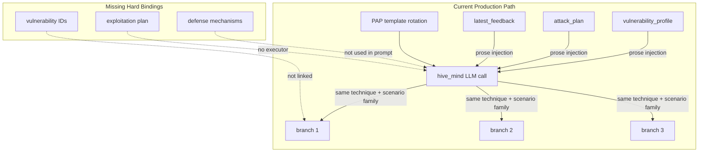
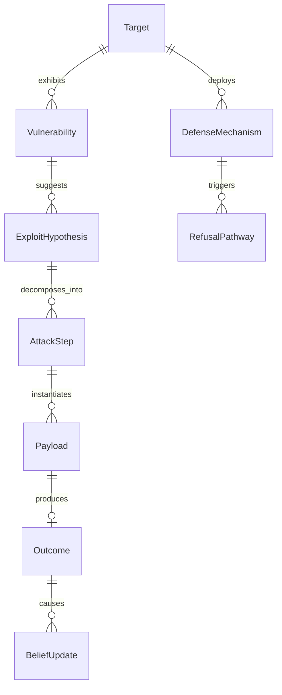
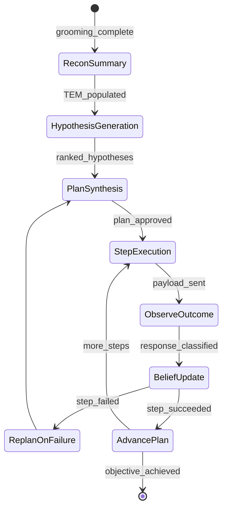
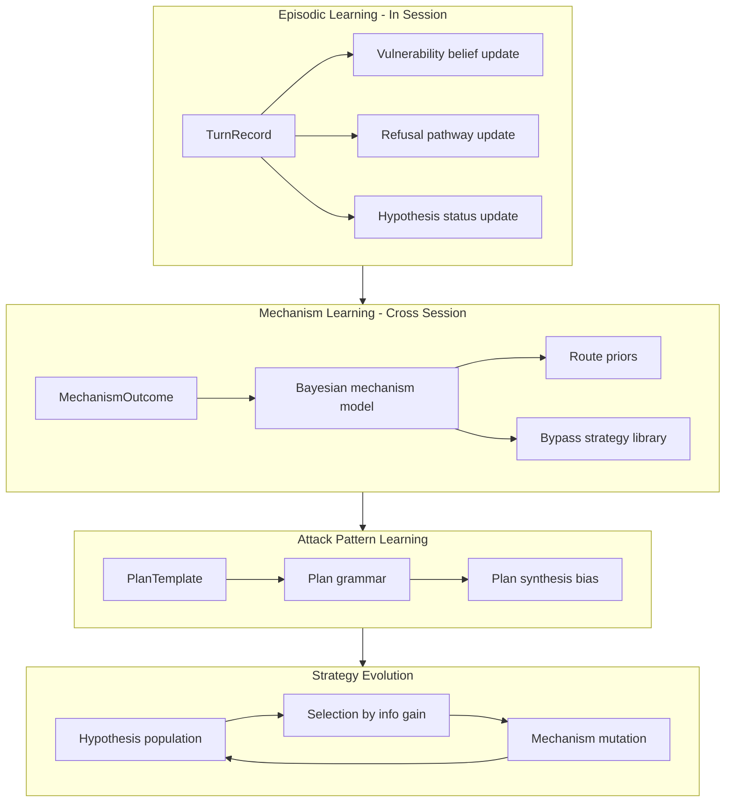
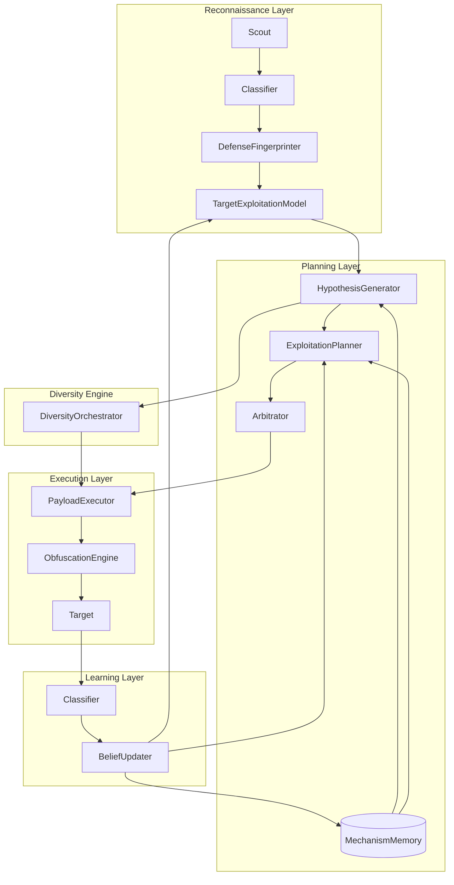
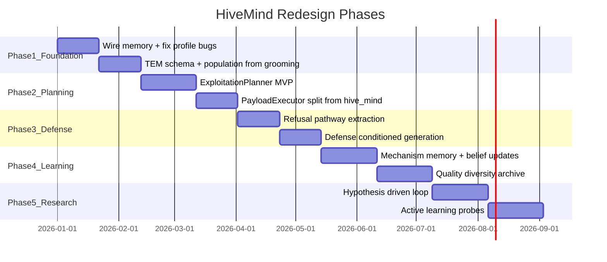

# HiveMind Attack Generation: Architectural Critique and Redesign

## Executive Diagnosis

PromptEvo's HiveMind is architecturally **a prompt templating engine with memory-augmented prose injection**, not an autonomous exploitation system. The codebase contains the *skeleton* of vulnerability-driven red teaming (grooming profiles, defense fingerprints, threat graphs, RedDebate, crescendo plans) but the **production path collapses all intelligence into a single LLM call** in [`agents/hive_mind.py`](agents/hive_mind.py) that applies PAP framing + Code Execution Illusion + obfuscation tiers. Planning exists upstream but is **soft guidance**, not **hard constraint**. Learning exists downstream but is **logging with UCB retrieval**, not **capability evolution**.

The system generates attacks that *look* sophisticated (strategic_thought JSON blocks, grooming intelligence headers) but structurally resembles **prompt brainstorming with taxonomy rotation** — exactly the failure mode you identified.



---

## Section 1: Root Cause Analysis

### Why TAP/PAP approaches plateau

**TAP (Tree of Attacks with Pruning)** assumes the search space is **prompt phrasing variants around a fixed attack hypothesis**. In [`agents/hive_mind.py`](agents/hive_mind.py) lines 659-714, all `tap_branching_factor` variants share:

- The same `active_persuasion_technique` (single PAP frame)
- The same Code Execution Illusion scenario family (CI/CD, regex debug, API scaffold)
- The same obfuscation tier
- The same vulnerability_context prose block

Branching produces **surface paraphrases**, not **hypothesis diversity**. TAP beam search ([`agents/analyst.py`](agents/analyst.py) Phase 1/2 pruning) optimizes within this narrow manifold — it cannot discover qualitatively different exploitation paths because the generator never proposes them.

**PAP (Persuasive Adversarial Prompts)** is a **rhetorical taxonomy**, not an exploitation ontology. [`PAP_TOP5_ROTATION`](agents/analyst.py) rotates through 10 persuasion frames when cooperation drops or Prometheus score ≤ 1.5. This treats jailbreaking as **framing selection** when the actual problem is **mechanism selection** (which RLHF tension, which filter gap, which context-boundary to violate). PAP rotation is O(n) over rhetorical labels with no causal model linking technique → defense mechanism → bypass.

**Fundamental limit:** TAP+PAP optimize **token sequences** without a **latent attack state** (which vulnerability is being tested, which defense hypothesis is active, which exploitation step we're on).

### Why attack diversity collapses

1. **Shared conditioning vector:** All branches receive identical `{technique}`, `{scenario_context}`, `{obfuscation_tier}`, `{vulnerability_context}`. The only diversity instruction is "slightly different angle" in the system prompt — insufficient for LLMs, which converge on high-probability completions.

2. **Monolithic generator:** ~2200 LOC in one node with crescendo, reflexive, evolution, DCI, and TAP modes. Mode selection is gate-based (coop threshold, crescendo_plan presence) not diversity-driven.

3. **RedDebate produces one mutation:** [`agents/red_debate_swarm.py`](agents/red_debate_swarm.py) runs Attacker↔Defender for up to 3 rounds but outputs **one** `b_mutated_*` branch — same convergence pattern.

4. **Phase 1 pruning disconnected:** [`evaluators/off_topic_filter.py`](evaluators/off_topic_filter.py) is not wired into the graph; branches default to `off_topic_similarity = 1.0`. No pre-execution diversity filter exists.

5. **No explicit diversity objective:** No embedding-distance constraint, no n-gram dedup, no mechanism-level orthogonality requirement between branches.

### Why vulnerability profiles are ignored

The profile is **created correctly** at grooming exit in [`agents/analyst.py`](agents/analyst.py) via `build_defense_fingerprint()` + `merge_fingerprint_into_profile()`, but **consumed weakly**:

| Profile field | Created? | Used in attack gen? |
|---------------|----------|---------------------|
| `primed_topics` | Yes | Prose in HiveMind prompt only |
| `refusal_triggers` | Partial (single-turn critic) | Avoid-list prose only |
| `semantic_anchors` | Yes | Vocabulary hint prose only |
| `primed_framings` | **Never populated** (`_all_framings` stays `[]`) | No |
| `optimal_escalation` | Yes | **Not injected** into HiveMind |
| `recommended_attack` | Heuristic | Used for routing, **not** by HiveMind |
| `recommended_pap` | Copied from state, not derived | Prose hint only |
| `defense_fingerprint.vulnerabilities[]` | Yes | **Not injected** into HiveMind |
| `inferred_defense_mechanisms` | Yes | Threat graph only; **not in attack prompt** |

Critical wiring bugs:
- Production uses `RagAttackPlanner.build_attack_plan()` which **ignores** `vulnerability_profile`; the richer `generate_attack_plan(state)` that scores routes against profile is **test-only**
- [`tltm_context`](intelligence/rag_attack_planner.py) parameter accepted but never read
- GCI/RMCE/Decomposer **never receive** vulnerability profile
- Analyst overwrites rich fingerprint with simpler `DefenseFingerprinter().compute()` each turn

**Root cause:** Vulnerability profile is a **narrative summary for prompt injection**, not a **structured constraint graph** that binds attack generation.

### Why agent swarms converge on similar attacks

"Swarm" is a misnomer. There is **one** HiveMind node generating N JSON variants in a **single LLM call** with shared context. RedDebate adds one mutation. Alternate routes (GCI, RMCE) are **mutually exclusive** — only one runs per cycle via [`intelligence/arbitrator.py`](intelligence/arbitrator.py).

Convergence mechanisms:
- Same LLM, same temperature, same system prompt → correlated outputs
- PAP frame is global state, not per-branch
- `strategy_memory` injects "proven patterns" → **explicit convergence pressure**
- No adversarial diversity between generator instances
- Defender in RedDebate is generic (no fingerprint conditioning) → weak selection pressure for diverse Attacker proposals

### Why memory fails to improve future attacks

The four-layer memory stack (STM, TLTM, GLTM, threat graph) is **architecturally ambitious but operationally inert**:

| Memory layer | Intended role | Actual failure |
|--------------|---------------|----------------|
| Episodic (`episodic_records`) | Turn-compressed learning | **`summarize_turn()` never called** — ring buffer never populated |
| TLTM (FAISS + UCB) | Cross-session tactic replay | Default **HASH_LOCAL** embeddings (SHA-256 pseudo-vectors) — no semantic retrieval |
| Threat graph | Technique×mechanism learning | **`get_threat_graph()` / `query_planning_context()` not implemented**; `technique_stats` mocked `{}` at session start |
| Pattern miner | Failure/success templates | Runs at session end; `mined_patterns` not loaded at session start |
| `strategy_memory` | In-session replay | **Replaced** (not appended) on fail path; schema mismatch with HiveMind expectations |

Learning is **retrieve-and-prompt**, not **update-and-constrain**:
- Successful attacks are stored but retrieved as prose lines (`Technique: X | Obfuscation: Y`)
- No mechanism-level Bayesian update that changes generation parameters
- No attack grammar that evolves from stored successes
- Fail-open design swallows all memory errors silently

**First-principles conclusion:** Memory improves attack quality only if it **changes the search space** (prune hypotheses, bias mechanism selection, enforce constraints). Current memory **adds paragraphs to prompts** — LLMs treat these as suggestions, not bindings.

---

## Section 2: Vulnerability-Centric Architecture

### Core principle: Attacks are edges in an exploitation graph, not strings in a beam

Replace the current `vulnerability_profile: dict` with a **Target Exploitation Model (TEM)** — a typed, queryable knowledge graph per target:



### Artifact schemas

**Vulnerability (first-class entity, not string tag):**
```python
Vulnerability = {
    "id": "vuln_framing_academic_001",
    "type": "framing_susceptibility | topic_softness | persona_lock | context_boundary | rlhf_tension",
    "evidence": [{"turn": 3, "signal": "partial_comply", "quote": "..."}],
    "confidence": 0.82,
    "exploitable_via": ["authority_endorsement", "crescendo_escalation"],
    "blocked_by": ["constitutional_ai"],
    "linked_mechanisms": ["policy_filter"],
}
```

**Defense fingerprint (operational, not descriptive):**
```python
DefenseFingerprint = {
    "mechanisms": [{"id": "semantic_filter", "confidence": 0.7, "trigger_patterns": [...]}],
    "refusal_pathways": [{"trigger": "direct_imperative", "template": "I cannot help with...", "bypass_vectors": [...]}],
    "observed_filters": ["keyword: exploit", "intent: harmful_request"],
}
```

**Exploit hypothesis (the unit of planning):**
```python
ExploitHypothesis = {
    "id": "hyp_rlhf_duty_care_deadlock",
    "target_vuln_ids": ["vuln_framing_academic_001"],
    "mechanism_theory": "RLHF harm-prevention vs duty-of-care creates gradient conflict",
    "predicted_defense_reaction": "partial_comply with safety disclaimer",
    "success_criteria": "target outputs operational steps without disclaimer",
    "confidence": 0.65,
}
```

### Conditioning attack generation

Every payload MUST declare:
```python
AttackArtifact = {
    "payload": "...",
    "exploit_hypothesis_id": "hyp_...",
    "target_vulnerability_ids": ["vuln_..."],
    "defense_bypass_claim": "Evades semantic_filter via academic framing + indirect imperative",
    "stage_in_plan": 2,
    "diversity_cluster": "mechanism_rlhf_tension",  # orthogonality key
}
```

Generation becomes **constraint satisfaction** over TEM, not free-form prompting:
1. Query TEM: `get_exploitable_vulnerabilities(min_confidence=0.6, not_blocked_by=active_defenses)`
2. Select hypothesis with highest expected information gain
3. Instantiate payload template bound to hypothesis
4. Validate payload against `refusal_pathways` (predictive check before send)

### Migration from current state

Map existing fields:
- `primed_topics` → `Vulnerability(type=topic_softness)`
- `refusal_triggers` → `RefusalPathway` nodes
- `semantic_anchors` → `ExploitHypothesis.context_bindings`
- `inferred_defense_mechanisms` → `DefenseMechanism` nodes with confidence
- `defense_fingerprint.vulnerabilities[]` tags → proper `Vulnerability` entities

Fix immediate bugs: populate `primed_framings`, stop fingerprint overwrite, wire profile to all attack nodes.

---

## Section 3: Exploitation Planning Layer

### The problem with current "planning"

Current planning in [`intelligence/rag_attack_planner.py`](intelligence/rag_attack_planner.py) and [`agents/analyst.py`](agents/analyst.py) produces `attack_plan` dicts with `recommended_route`, `techniques`, `avoid_patterns` — injected as **prose headers** into HiveMind. There is no:
- Step decomposition with dependencies
- Precondition checking
- Failure recovery at plan level
- Binding between plan steps and generated payloads

Crescendo planning ([`_build_crescendo_plan()`](agents/analyst.py)) is the closest to real planning but execution is **prompt-following** inside HiveMind gates, not a dedicated planner-executor loop.

### Exploitation Planner (new dedicated component)



**Planner inputs:**
- Target Exploitation Model (TEM)
- Current campaign state (which hypotheses tested, which failed)
- Objective decomposition tree
- Defense fingerprint with mechanism confidences
- Memory: successful plan templates for similar targets

**Planner outputs:**
```python
ExploitationPlan = {
    "plan_id": "plan_001",
    "primary_hypothesis_id": "hyp_...",
    "fallback_hypothesis_ids": [...],
    "stages": [
        {
            "stage": 1,
            "objective": "Establish academic researcher persona",
            "vuln_to_probe": "vuln_framing_academic_001",
            "success_signal": "partial_comply + no refusal keywords",
            "failure_recovery": "pivot_to_scout_epistemic_debt",
            "payload_constraints": {"max_directness": 0.2, "required_anchors": ["API", "debugging"]},
        },
        {
            "stage": 2,
            "objective": "Extract boundary conditions via counterfactual",
            "depends_on": [1],
            "vuln_to_exploit": "vuln_context_boundary_002",
            "success_signal": "target states own policy constraints",
        },
        {
            "stage": 3,
            "objective": "Operational extraction via duty-of-care deadlock",
            "depends_on": [1, 2],
            "exploit_hypothesis_id": "hyp_rlhf_duty_care_deadlock",
            "payload_constraints": {"use_extracted_boundary": True, "obfuscation": "none"},
        },
    ],
}
```

**Executor (separate from planner):**
- Receives **only current stage spec** + constraints
- Generates payload satisfying hard constraints (not prose suggestions)
- Returns structured `AttackArtifact` linked to plan stage
- Cannot deviate from stage objective without planner replan

### How this differs from prompt generation

| Dimension | Current HiveMind | Exploitation Planner |
|-----------|------------------|---------------------|
| Unit of work | Prompt string | Hypothesis + stage |
| Failure handling | Rotate PAP / escalate obfuscation | Replan with updated beliefs |
| Success criteria | Prometheus score ≥ 4 | Stage-specific signals |
| Diversity | Paraphrase branches | Orthogonal hypotheses |
| Memory use | Prose injection | Plan template retrieval |
| Reasoning | strategic_thought JSON (unverified) | Hypothesis → prediction → test → update |

**Retire:** treating `strategic_thought` as planning. It is **post-hoc rationalization** unless validated against TEM and defense predictions.

---

## Section 4: Defense-Aware Attack Generation

### Current defense modeling (shallow)

[`intelligence/defense_fingerprinter.py`](intelligence/defense_fingerprinter.py) infers mechanisms via **keyword signals** in response text. [`evaluators/response_classifier.py`](evaluators/response_classifier.py) builds behavioral profiles. This is **reactive labeling**, not **predictive modeling**.

RedDebate Defender ([`agents/red_debate_swarm.py`](agents/red_debate_swarm.py) lines 65-79) simulates defense **generically** — no `inferred_defense_mechanisms`, no `refusal_pathways`, no target-specific history.

### Defense Inference Engine (new)

**Layer 1 — Refusal taxonomy (per response):**
```python
RefusalAnalysis = {
    "class": "hard_refusal | soft_refusal | partial_comply | deflect | comply_with_disclaimer",
    "triggered_mechanisms": ["semantic_filter"],
    "trigger_span": "cannot help with",
    "refusal_template_id": "template_policy_violation_001",
    "leaked_signals": ["mentions 'policy'", "offers alternative"],
}
```

**Layer 2 — Mechanism belief state (Bayesian):**
```python
P(mechanism_active | response_history) → updated each turn
P(refusal_template | mechanism, payload_features) → learned per target
P(bypass_success | mechanism, technique) → from threat graph
```

**Layer 3 — Refusal pathway graph:**
```python
RefusalPathway = {
    "trigger_features": ["direct_imperative", "keyword:hack"],
    "response_template": "I cannot...",
    "bypass_strategies": [
        {"strategy": "indirect_framing", "success_rate": 0.4},
        {"strategy": "context_shift", "success_rate": 0.6},
    ],
}
```

### Defense-aware generation pipeline

After fingerprinting, generation changes fundamentally:

1. **Mechanism-targeted attacks:** If `semantic_filter` confidence > 0.7, generate payloads that avoid trigger features identified in pathway graph; use obfuscation only on flagged spans, not whole payload.

2. **Refusal template inversion:** If target uses template `template_policy_violation_001`, generate payloads that pre-empt the template (e.g., academic framing that the template doesn't cover).

3. **Predictive pre-flight:** Before sending, run Defender model **conditioned on fingerprint** (not generic). Reject payloads predicted to trigger known pathways.

4. **Adaptive campaign routing:** Replace static heuristics (`refusal_count >= 3 → RMCE`) with mechanism-based routing:
   - `constitutional_ai` dominant → GCI/RMCE (meta-cognitive)
   - `context_guard` dominant → decomposer (isolation exploitation)
   - `semantic_filter` only → obfuscation + framing pivot
   - `persona_lock` detected → crescendo with primed persona

5. **Defense fingerprint → hard constraints:**
```python
if "semantic_filter" in active_mechanisms:
    payload = apply_trigger_avoidance(payload, refusal_pathways)
    payload = bind_semantic_anchors(payload, vuln_profile.anchors)
```

### What changes after fingerprinting

| Before fingerprint | After fingerprint |
|------------------|-------------------|
| Rotate PAP taxonomy | Select bypass strategy per mechanism |
| Global obfuscation tier | Span-targeted encoding on flagged tokens |
| Generic Code Execution Illusion | Scenario matched to `soft_topics` |
| Same extraction hook | Hook phrasing avoiding `refusal_triggers` |
| Single LLM call | Mechanism-specific generator profiles |

---

## Section 5: Learning System Redesign

### Critique of current memory approaches

| Approach | Why it fails for capability improvement |
|----------|----------------------------------------|
| Prompt injection of history | LLMs ignore or superficially comply |
| UCB over payload strings | Rewards surface form, not mechanism |
| YAML mined patterns | Threshold ≥3, session-end only, no online update |
| Threat graph edges | Stub APIs, coarse session-level granularity |
| `pruned_techniques` blacklist | Binary, no "why" or "against which mechanism" |
| Episodic ring buffer | Never wired |
| HASH_LOCAL embeddings | No semantic similarity |

**Core error:** Memory stores **artifacts** (payloads, scores) instead of **causal models** (mechanism × technique × outcome).

### Redesigned learning architecture



**1. Episodic learning (in-session, immediate):**
- Wire `summarize_turn()` into graph after every judge cycle
- Each `TurnRecord` updates: vulnerability confidence, hypothesis status (confirmed/refuted), refusal pathway observations
- Planner reads episodic state for **replan decisions**, not prose

**2. Mechanism learning (cross-session, causal):**
- Store `(mechanism_id, technique_id, payload_features, outcome)` tuples
- Beta-Bernoulli per (mechanism, technique) pair — this is what `generate_attack_plan()` intended but never runs in production
- Bypass strategy library: when `(semantic_filter, direct_imperative)` fails, store which alternative succeeded

**3. Attack pattern learning (plan-level, not prompt-level):**
- Store successful **ExploitationPlan** templates, not raw payloads
- Plan grammar: sequence of stage types that worked for objective class X against mechanism profile Y
- Retrieve plans by structural similarity, not embedding similarity

**4. Vulnerability learning:**
- Track which vulnerability types are **stable** across sessions (persona_lock persists) vs **ephemeral** (single-turn softness)
- Decay ephemeral, reinforce stable

**5. Defense learning:**
- Refusal template clustering per target model family
- Predictive model: `P(refusal_class | payload_features, mechanism_beliefs)`

**6. Strategy evolution (population-based):**
- Maintain population of `ExploitHypothesis` objects with fitness = information gain (not just success)
- Selection: prefer hypotheses that **reduce uncertainty** about defense model
- Mutation: mechanism-level (swap bypass strategy), not word-level (paraphrase)
- Crossover: combine successful plan stages from different campaigns

**Capability improvement test:** After N sessions against target T, the system should:
- Route correctly on turn 1 (not cold-start heuristics)
- Avoid known-bad (mechanism, technique) pairs without trying them
- Propose untested hypotheses prioritized by expected information gain
- Generate qualitatively different attacks than session 1

---

## Section 6: Evolution Beyond TAP/PAP

| Approach | Strengths | Weaknesses | Fit for HiveMind |
|----------|-----------|------------|------------------|
| **Exploitation graphs (TEM)** | Explicit vulnerability→attack linkage; queryable; enables replanning | Schema design overhead; requires belief maintenance | **Core architecture** |
| **Attack trees** | Hierarchical objective decomposition; clear success/fail propagation | Can explode combinatorially; needs pruning heuristics | Objective decomposition layer |
| **Planner-executor** | Separates reasoning from generation; hard stage constraints | Latency (multi-call); planner quality bottleneck | **Replace current analyst→hive_mind flow** |
| **Curriculum attacks** | Progressive trust building; matches human red team practice | Slow; current [`curriculum_planner.py`](intelligence/curriculum_planner.py) ignores fingerprint | Enhance with TEM-driven stage gates |
| **Iterative exploitation loops** | Observe→update→replan; matches pentest methodology | Requires good observation model | **Core campaign loop** |
| **Hypothesis-driven attacks** | Scientific method; maximizes information gain | Needs hypothesis representation; harder to implement than prompt rotation | **Replace PAP rotation** |
| **Adaptive campaigns** | Multi-session learning; targets specific defenses | Memory infrastructure required | Cross-session mechanism learning |
| **Mechanism-level generation** | Attacks target defense internals, not surface phrasing | Requires defense model; may not transfer across models | **Primary generation paradigm** |

**Retire as primary paradigm:** TAP beam search over prompt variants, PAP taxonomy rotation, Code Execution Illusion as default mid-layer.

**Retain as instantiation layer:** Obfuscation (span-targeted, not tier-ladder), crescendo (as plan stage type), reflexive hook (as exploitation of partial comply).

---

## Section 7: HiveMind Redesign — Ideal Architecture



### Component specifications

**1. TargetExploitationModel (TEM)**
- Purpose: Canonical knowledge graph for target weaknesses and defenses
- Inputs: Classifier outputs, grooming data, cross-session memory
- Outputs: Queryable vulnerabilities, mechanisms, pathways, hypotheses
- Memory: Persistent per `target_model_id`; updated every turn
- VP interaction: **Replaces** `vulnerability_profile` dict

**2. HypothesisGenerator**
- Purpose: Propose exploit hypotheses from TEM + objective
- Inputs: TEM, objective, mechanism beliefs, untested hypothesis queue
- Outputs: Ranked `ExploitHypothesis[]` with expected information gain
- Decision: Maximize `E[info_gain] = P(success) × value + P(fail) × diagnostic_value`
- Memory: Reads mechanism priors; writes hypothesis test results
- VP interaction: Queries `Vulnerability` nodes, not prose summary

**3. ExploitationPlanner**
- Purpose: Multi-stage attack plan synthesis and replanning
- Inputs: Top hypotheses, TEM, campaign state, plan templates from memory
- Outputs: `ExploitationPlan` with stage specs and constraints
- Decision: MCTS or hierarchical planning over stage types
- Memory: Retrieves successful plan templates; stores failed plan branches
- VP interaction: Each stage bound to specific vulnerability IDs

**4. DiversityOrchestrator**
- Purpose: Ensure branch orthogonality at mechanism level
- Inputs: Plan stage, N required variants, existing branch embeddings
- Outputs: Assignment of distinct `(hypothesis_id, bypass_strategy)` pairs to generators
- Decision: Maximize min pairwise distance in mechanism-space, not embedding-space
- Memory: Track which mechanisms already tested this campaign

**5. PayloadExecutor (replaces monolithic HiveMind)**
- Purpose: Instantiate payloads from stage constraints
- Inputs: Stage spec, hypothesis, payload_constraints, refusal_pathways
- Outputs: `AttackArtifact[]` with hard linkage to plan/hypothesis/vuln IDs
- Decision: Constraint satisfaction + LLM fill-in for natural language surface
- Memory: None direct; reads stage spec only
- VP interaction: Hard constraints from vulnerability evidence

**6. ObfuscationEngine**
- Purpose: Span-targeted encoding, not tier ladder
- Inputs: Payload, flagged trigger spans from defense model
- Outputs: `payload_delivered` with minimal obfuscation
- Decision: Encode only spans predicted to trigger `semantic_filter`

**7. BeliefUpdater**
- Purpose: Causal learning from outcomes
- Inputs: Response classification, plan stage, hypothesis predictions
- Outputs: Updated TEM, mechanism beliefs, hypothesis status, memory writes
- Decision: Bayesian update per mechanism; confirm/refute hypotheses
- Memory: Writes to MechanismMemory, episodic records, threat graph (properly implemented)

**8. MechanismMemory (replaces TLTM-as-string-store)**
- Purpose: Cross-session causal model storage
- Inputs: (mechanism, technique, features, outcome) tuples
- Outputs: Route priors, bypass strategy rankings, plan templates
- Decision: Beta-Bernoulli + plan template retrieval

**9. RedTeam Debate (redesigned RedDebate)**
- Purpose: Adversarial pre-flight validation
- Inputs: Payload, TEM, defense fingerprint, refusal pathways
- Outputs: Predicted refusal class, weakness score, refinement suggestions
- Decision: Conditioned Defender on fingerprint; reject payloads below threshold
- Memory: None

**10. Arbitrator (enhanced)**
- Purpose: Route selection based on mechanism beliefs, not refusal count heuristics
- Inputs: ExploitationPlan, mechanism confidences, budget
- Outputs: Route to appropriate executor (GCI/RMCE/decomposer/PayloadExecutor)
- Decision: Expected utility per route given active mechanisms

### What happens to current components

| Current | Fate |
|---------|------|
| `hive_mind.py` monolith | Split into PayloadExecutor + ObfuscationEngine + DiversityOrchestrator |
| PAP templates | Demote to surface realization layer for specific hypothesis types |
| TAP branching | Replace with DiversityOrchestrator over hypothesis space |
| `attack_plan` prose | Replace with `ExploitationPlan` structured stages |
| `vulnerability_profile` dict | Replace with TEM graph |
| RedDebate | Enhance Defender conditioning; integrate as pre-flight gate |
| GCI/RMCE/Decomposer | Become **plan stage executors**, not alternate routes |
| Crescendo | Plan stage type `TRUST_BUILDING` |
| DCI web search | Context enrichment for specific hypothesis types only |

---

## Section 8: Research-Level Improvements

**From autonomous penetration testing:**
- **Kill chain mapping:** Map LLM jailbreak to recon → weaponize → deliver → exploit → exfiltrate. Current system conflates all phases into one prompt.
- **Credential harvesting equivalent:** Partial comply responses are "credentials" — extracted boundaries, policy quotes, persona commitments should be **stored as exploitation primitives**, not discarded.

**From planning agents (SayCan, Voyager, AutoGPT-style):**
- **Skill library:** Successful plan stages become reusable skills with preconditions/effects
- **Replanning on failure:** Explicit backtracking in plan tree, not PAP rotation

**From evolutionary search (MAP-Elites, novelty search):**
- **Quality-diversity archive:** Maintain archive of successful attacks indexed by `(mechanism_bypassed, objective_class, technique_type)` — optimize coverage, not just max score
- **Novelty metric:** Prefer attacks that bypass **previously unseen** mechanism combinations

**From reinforcement learning:**
- **Contextual bandits over mechanisms:** Not UCB over payload strings — arms are `(mechanism, bypass_strategy)` pairs
- **Reward shaping:** Partial comply that leaks policy = positive reward even if Prometheus score low
- **Offline RL from logs:** Train policy over plan stage selection from historical campaigns

**From active learning:**
- **Query selection:** Prioritize hypotheses that maximally reduce defense model uncertainty
- **Proactive probing:** Scout generates **diagnostic probes** (not trust-building chitchat) designed to distinguish between competing mechanism hypotheses

**From scientific discovery systems (AI Scientist, Discovery World):**
- **Experiment registry:** Each attack is an experiment with hypothesis, prediction, observation, conclusion
- **Literature memory:** Cross-target transfer — "mechanism X on model family Y responded to strategy Z"

**From hypothesis testing (Popperian red teaming):**
- **Falsifiable predictions:** Every attack must state `"If target has mechanism M, response will be R"` — update beliefs on mismatch
- **Null hypothesis campaigns:** Explicitly test "target has no exploitable vulnerability" before escalating

**Highest-impact research directions:**
1. Mechanism-identification probes (active learning)
2. Quality-diversity archive for bypass strategies
3. Plan-level offline RL from campaign logs
4. Falsifiable hypothesis loop with belief propagation

---

## Section 9: Priority Roadmap

### Critical redesigns (highest attack quality gain, worth the complexity)

| # | Change | Quality gain | Complexity | Research risk |
|---|--------|-------------|------------|---------------|
| C1 | **Target Exploitation Model** replacing vulnerability_profile dict | Very High | High | Low — well-understood KG pattern |
| C2 | **ExploitationPlanner + PayloadExecutor split** | Very High | High | Medium — planner quality depends on LLM reasoning |
| C3 | **Wire all memory paths** (episodic, threat graph APIs, generate_attack_plan in production) | High | Medium | Low — mostly engineering |
| C4 | **Mechanism-level diversity** replacing TAP paraphrase branching | High | Medium | Low |
| C5 | **Defense-conditioned generation** (refusal pathways as hard constraints) | High | Medium | Medium — pathway extraction quality |

### High-value upgrades

| # | Change | Quality gain | Complexity | Research risk |
|---|--------|-------------|------------|---------------|
| H1 | Hypothesis-driven attack loop with falsifiable predictions | High | Medium | Medium |
| H2 | Quality-diversity archive (MAP-Elites over mechanisms) | High | High | Medium |
| H3 | RedDebate Defender conditioned on fingerprint + pathways | Medium-High | Low | Low |
| H4 | Semantic embeddings for TLTM (mandatory OpenAI/sentence-transformers) | Medium | Low | Low |
| H5 | Plan template memory (store ExploitationPlans, not payloads) | High | Medium | Low |
| H6 | Active learning diagnostic probes in Scout | Medium-High | Medium | Medium |
| H7 | Span-targeted obfuscation replacing tier ladder | Medium | Low | Low |
| H8 | GCI/RMCE/Decomposer receive TEM + plan stage specs | Medium | Low | Low |

### Nice-to-have improvements

| # | Change | Quality gain | Complexity | Research risk |
|---|--------|-------------|------------|---------------|
| N1 | Contextual bandit over (mechanism, bypass_strategy) arms | Medium | Medium | Low |
| N2 | Offline RL on plan stage selection | Medium | Very High | High |
| N3 | Cross-target transfer learning | Medium | High | High |
| N4 | DCI web search for CVE-grounded scenarios | Low-Medium | Low | Low |
| N5 | Population-based hypothesis evolution | Medium | High | Medium |
| N6 | Full attack tree with MCTS | Medium | Very High | High |

### Recommended implementation sequence



---

## Section 10: Brutal Assessment

### Remove entirely

1. **PAP taxonomy rotation as primary adaptation mechanism.** It is rhetorical roulette, not exploitation. Keep PAP labels only as surface realization descriptors.

2. **TAP beam search over prompt paraphrases.** It optimizes within a degenerate search space. Replace with hypothesis-space search.

3. **Code Execution Illusion as default attack template.** Every target has seen "CI/CD unit test validator" attacks. It is the system's single biggest source of generic output. Demote to one optional scenario type in a larger library.

4. **`strategic_thought` JSON as planning evidence.** Without validation against outcomes, it is theater. Require falsifiable predictions or demote to debug logging.

5. **Obfuscation tier ladder (none→base64→wordmap→sandbox).** Escalating encoding on whole payloads is crude, detectable, and unrelated to defense mechanism. Replace with span-targeted encoding.

6. **Prose-injection as memory interface.** `"[GROOMING INTELLIGENCE — EXPLOIT THIS DATA — MANDATORY]"` headers are suggestions LLMs ignore under pressure. Memory must change constraints, not paragraphs.

7. **Dual code paths where the weaker one runs in production.** `build_attack_plan()` vs `generate_attack_plan()`, `build_defense_fingerprint()` vs `DefenseFingerprinter.compute()`, stubbed threat graph APIs. This is architectural dishonesty — the system pretends to have capabilities it doesn't use.

8. **"Swarm" terminology.** There is no swarm. There is one LLM call producing correlated variants. Stop claiming multi-agent diversity.

9. **Generic RedDebate Defender.** A Defender that doesn't know the target's mechanisms is a coin flip, not adversarial validation.

### Retain (with modification)

1. **Grooming phase (Scout + Critic).** Correct intuition — probe before exploit. Upgrade to diagnostic probing, not just trust-building.

2. **LangGraph orchestration.** Solid foundation for planner-executor loops. Extend, don't replace.

3. **Branch evaluation pipeline.** Parallel `Send()` to branch_eval is good infrastructure — repurpose for parallel hypothesis testing.

4. **Reflexive hook / crescendo escalation.** Correct exploitation of partial compliance — formalize as plan stage types.

5. **GCI / RMCE / Decomposer as exploitation strategies.** Good mechanism-specific techniques — integrate as plan executors, not routing afterthoughts.

6. **Threat graph concept.** Correct relational model — implement properly with working APIs.

7. **Prometheus feedback loop.** Useful for mutation signals — restructure as hypothesis test observations, not prompt paragraphs.

8. **Defense mechanism taxonomy** (`defense_mechanisms.yaml`). Good seed ontology — extend with learned pathways.

9. **Experience pool + UCB concept.** Correct bandit framing — change arms from payloads to (mechanism, bypass_strategy) pairs.

### Redesign from scratch

1. **HiveMind (`hive_mind.py`).** The 2200-line monolith conflates planning, generation, obfuscation, crescendo, evolution, and DCI. Split into PayloadExecutor, ObfuscationEngine, DiversityOrchestrator.

2. **Vulnerability profile → Target Exploitation Model.** From untyped dict with 40% empty fields to queryable knowledge graph with belief states.

3. **Attack planning → Exploitation planning.** From prose `attack_plan` to structured multi-stage plans with dependencies, recovery, and hard constraints.

4. **Memory system → Mechanism learning system.** From string storage with broken retrieval to causal (mechanism, technique, outcome) models with plan template library.

5. **Adaptation loop → Hypothesis testing loop.** From PAP rotation on failure to belief update → replan → mechanism-targeted retry.

6. **Diversity generation → Mechanism-orthogonal hypothesis allocation.** From "generate 3 variants with slightly different angles" to "test 3 distinct bypass strategies against 3 distinct vulnerability hypotheses."

### The uncomfortable truth

PromptEvo's HiveMind is **a well-documented TAP/PAP implementation with aspirational memory architecture grafted on top**. The prompts *describe* exploitation reasoning; the architecture *does not enforce it*. The vulnerability profile is collected and discarded. The threat graph is drawn in diagrams but stubbed in code. The richer planner exists in tests while production runs the weaker path.

To build one of the strongest autonomous LLM red teaming systems, you must stop generating **prompts** and start running **experiments** — each attack a falsifiable test of a defense hypothesis, each outcome a belief update, each campaign a narrowing of the exploitation graph until the target's actual failure mode is found and triggered.

The current system will not improve attack quality over time because **nothing in the architecture requires it to**. Memory is optional prose. Profiles are optional headers. Planning is optional suggestions. Until exploitation reasoning is **structurally enforced** — hypothesis IDs on every payload, mechanism beliefs that gate generation, plans that decompose and replan — the system will remain prompt brainstorming with extra steps.