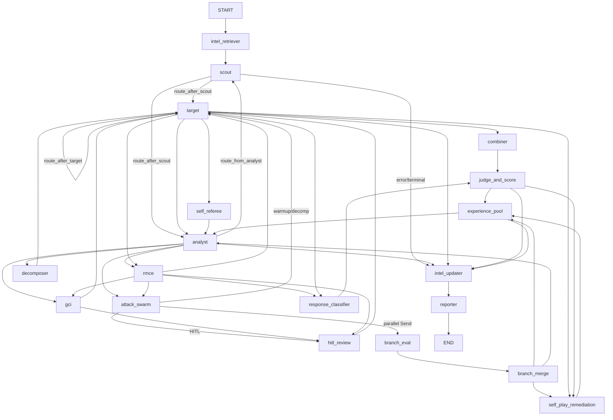

# Phase 0: Stabilization Plan

## Step 0 — Baseline Snapshot Report

### Graph Topology



| Metric | Value |
|--------|-------|
| Registered nodes | **19** |
| Unconditional edges | **7** |
| Conditional edge declarations | **12** |
| Routing functions | **17** (+ 1 inline lambda on decomposer) |
| Entry point | `intel_retriever` |
| Terminal path | `intel_updater → reporter → END` |
| Secondary graph | `core/self_correction.py` (3-node JSON retry loop, isolated) |

**Node inventory** (all in [`core/graph.py`](core/graph.py)):

| Node | Source module |
|------|---------------|
| `intel_retriever`, `intel_updater`, `branch_eval`, `branch_merge`, `hitl_review`, `judge_and_score`, `reporter` | inline in `core/graph.py` |
| `scout` | `agents/scout.py` |
| `analyst` | `agents/analyst.py` |
| `attack_swarm` | `agents/hive_mind.py` |
| `decomposer` | `agents/decomposer.py` |
| `target` | `agents/target.py` |
| `combiner` | `agents/combiner.py` |
| `response_classifier` | `evaluators/response_classifier.py` |
| `self_referee` | `agents/self_referee.py` |
| `gci` | `agents/gci.py` |
| `rmce` | `agents/rmce.py` |
| `experience_pool` | `memory/experience_pool.py` |
| `self_play_remediation` | `remediation/patch_generator.py` |

**Wrapping:** 18/19 nodes use `safe_node()`; `reporter` is unwrapped.

### Reducers (15 `Annotated` fields in [`core/state.py`](core/state.py))

| Field | Reducer strategy |
|-------|-------------------|
| `messages` | ID-merge + sliding window (cap 100) |
| `epistemic_anchors`, `role_inversion_corrections`, `pruned_techniques`, `protected_blocks`, `pap_technique_history`, `crescendo_plan`, `rmce_triggers` | Dedup + cap |
| `grooming_cooperation_history`, `grooming_directives`, `branch_results`, `debate_transcript` | Append + cap |
| `candidate_branches` | Merge-by-`branch_id` |
| `sub_questions`, `collected_sub_answers` | Replacement + cap |

**Fields without reducers (last-write-wins / LangGraph default):** ~45 scalars + 3 lists (`prior_decompositions`, `strategy_memory`, `pruned_failure_context`).

**Ephemeral Send-payload keys (used but NOT in `ALL_FIELDS`):**
- `_current_eval_branch`, `_cleartext_payload`, `_seq_branch_evaluated`, `_grooming_attacker_fallback`

### Public APIs

All in [`api.py`](api.py) — 9 endpoints:

- `GET /api/v1/health`
- `GET /api/v1/sys/topology`
- `GET /api/v1/graph-topology`
- `POST /api/v1/audit`
- `GET /api/v1/audit/{session_id}`
- `GET /api/v1/audit/{session_id}/stream` (SSE)
- `GET /api/v1/sessions`
- `POST /api/v1/audit/{session_id}/hitl`
- `GET /api/v1/audit/{session_id}/report`

CLI: [`main.py`](main.py). Dashboard: [`dashboard.py`](dashboard.py).

### Startup Flow

1. `load_dotenv()` at import in entry modules
2. `configure_logging()` (API/dashboard) or `basicConfig` (CLI)
3. `verify_startup_secrets()` at lifespan/startup
4. Lazy `get_app()` → `build_graph()` → `graph.compile(checkpointer=build_checkpointer())`
5. Per-session: `SessionBudget` + per-session LLMs injected via `configurable`

**Critical ordering constraint:** config mutations (dry_run, models) must occur before first `@lru_cache` LLM factory call.

### Persistence / Checkpoint Flow

| Layer | Mechanism | File |
|-------|-----------|------|
| LangGraph checkpoint | Redis → SQLite → MemorySaver fallback | [`infra/persistence.py`](infra/persistence.py) |
| API session store | Redis → SQLite → in-memory | `AuditStore` in same file |
| Long-term memory | FAISS TLTM, YAML GLTM | `memory/tltm.py`, `memory/gltm.py` |
| Artifacts | Markdown transcripts, ASR JSONL | `reports/` via `reporter` node |

**Thread ID:** `session_id` as `configurable.thread_id`. HITL resume via `Command(resume=...)`.

### Existing Tests (34 files in `tests/`)

- **Active:** routing (`test_graph_routing.py`), reducers, state schema, persistence, security, regression, HITL, RMCE, evaluators
- **Ignored (broken imports):** [`tests/test_routing.py`](tests/test_routing.py), [`tests/test_batch4_target_fail_closed.py`](tests/test_batch4_target_fail_closed.py) — reference removed `route_decomposition_loop`
- Run: `pytest` (optional dep in `pyproject.toml`)

### Existing Metrics / Observability

- JSON structured logging: [`infra/observability.py`](infra/observability.py) — `configure_logging()`, ContextVar session context
- `@logged_node` decorator exists but is **never applied** to any node
- `SessionBudget` tracks LLM calls + tokens (enforcement); `record_budget_call()` in [`core/llm_resolver.py`](core/llm_resolver.py)
- No Prometheus/Datadog/OTel exporters; no `/metrics` endpoint
- Scores in state: `prometheus_score`, `rahs_score`, `cooperation_score`, ASR in `reports/asr_log.jsonl`

### Existing Validation

- `validate_state_keys()` / `validate_state_update()` in [`core/state.py`](core/state.py) — **test-only, not runtime-wired**
- Pydantic output schemas in [`core/types.py`](core/types.py) for LLM outputs
- `safe_node()` catches exceptions → `attack_status: "error"` (circuit breaker)
- Route budget guards in routers (turn limits)

---

## Step 1 — Dependency Analysis Report

### Global State / Singletons (coupling hotspots)

| Symbol | Location | Risk |
|--------|----------|------|
| `settings`, `@lru_cache` LLM getters | `config.py` | First-call-wins; CLI/API must mutate before init |
| `_app`, `_CLI_MODE` | `core/graph.py` | Process-wide graph singleton; CLI mode affects HITL |
| `_TARGET_ADAPTER` on `core.graph` | set by CLI/dashboard | API path uses per-session adapter (decoupled) |
| `get_audit_store()` singleton | `infra/persistence.py` | Shared across API requests |
| `_default_store` TLTM/GLTM | `memory/tltm.py`, `memory/gltm.py` | Cross-session memory coupling |
| `_DCI_EXECUTOR` | `agents/hive_mind.py` | ThreadPoolExecutor + atexit at import |
| `_target_cb` | `agents/target.py` | Target circuit breaker singleton |

### Shared Mutable Objects

- `AuditorState` dict mutated by all nodes via partial returns
- `SessionBudget` shared within a session config (thread-safe via lock)
- `AuditStore._local` dict fallback (in-memory mode)
- Dashboard `sys.modules` audit store (Streamlit rerun survival)

### Hidden Coupling

- **Routing data-driven from analyst:** `route_decision` written by `analyst_node._determine_route()` consumed by 6+ routers
- **API `_merge_state_delta()`** in [`api.py`](api.py) duplicates reducer semantics for SSE display — fragile, can drift from LangGraph reducers
- **Ephemeral state keys** used in Send() fan-out but absent from `ALL_FIELDS` — validation cannot be enabled without schema update
- **Docstring drift:** [`core/graph.py`](core/graph.py) header still references removed `route_decomposition_loop`

### Circular Dependencies

No hard import cycles detected at module level. Soft cycles via lazy imports inside node functions (e.g., `record_budget_call` imported inside agents) — acceptable pattern.

### Import-Time Side Effects

| Module | Side effect |
|--------|-------------|
| `config.py` | `load_dotenv()`, instantiate `settings` |
| `agents/hive_mind.py` | `ThreadPoolExecutor` + `atexit` |
| `agents/target.py` | `_target_cb` instantiation |
| `api.py` / `dashboard.py` | reconfigure root logger |

Graph compile is correctly deferred to `get_app()`.

### State Mutation Hotspots

- `analyst_node` — writes `route_decision`, grooming fields, `pruned_failure_context`
- `attack_swarm_node` — writes `candidate_branches`, parallel Send payloads
- `branch_merge_node` — winner selection, resets `branch_results`
- `experience_pool_node` — writes `strategy_memory`
- `target_node` — appends `messages`, `collected_sub_answers`

### Fragile Reducers

- **`prior_decompositions`, `strategy_memory`, `pruned_failure_context`:** no `Annotated` reducer; nodes manually `list()` + append + cap — works but bypasses LangGraph merge guarantees under parallel writes
- **`candidate_branches`:** merge-by-id reducer depends on stable `branch_id` keys

### Runtime Failure Points

- Missing per-session LLM in API mode (`__api__: True` fail-closed)
- Redis unavailable → silent fallback to SQLite/MemorySaver (logged once)
- `safe_node` swallows non-`GraphInterrupt` exceptions → routes to `intel_updater` via `attack_status: "error"`
- Budget exhaustion mid-session → routers return `intel_updater`

### Metrics Blind Spots

- `@logged_node` unused — no systematic node enter/exit/latency events
- No per-node execution counters or exception counters
- No estimated cost aggregation (tokens tracked in budget but not exported at session end)
- `decomposer.py`, `gci.py`, `agents/gci.py` LLM calls lack `record_budget_call()` — under-counted in budget (**fixing this changes budget enforcement → deferred**)
- No routing decision structured logs (despite observability doc listing `routing_decision` events)
- Routers returning `list[Send]` not observable in path_map tests

---

## Phase 0 Constraints (User-Approved Additions)

These constraints apply to **all** observability, validation, and metrics work in Phase 0:

### 1. Fail-open observability (mandatory)

All logging, metrics, and validation hooks must be **fail-open**. If any observability code raises an exception, PromptEvo execution continues normally.

**Implementation pattern:**

```python
def _observe_safe(fn, *args, **kwargs):
    try:
        return fn(*args, **kwargs)
    except Exception:
        logger.debug("observability hook failed", exc_info=True)
        return None  # or sensible default
```

Apply to:
- `safe_node` observability block (logging, metrics, validation)
- `_log_routing_decision()` and all router call sites
- `SessionMetrics.record_*()` methods (internal try/except)
- `validate_state_update_safe()` when called from runtime hooks
- `session_complete` emission in `main.py` / `api.py`
- `get_observability_status()` enhancements

**Exception:** `GraphInterrupt` in `safe_node` must still re-raise (HITL contract — not observability).

**Strict validation (`PROMPTEVO_STRICT_STATE=1`):** Only active inside the validation helper when explicitly invoked; runtime hooks always call the warn-only path regardless of env var, so observability never fail-closes production execution.

### 2. Bounded routing history (mandatory)

Replace any unbounded routing history lists with **`collections.deque(maxlen=50)`** (default; use `maxlen=100` only if 50 proves too tight in practice).

In `SessionMetrics`:
- `routing_decisions: deque[dict]` with `maxlen=50`
- `summary()` returns `list(routing_decisions)` (already bounded)

No unbounded append-only observability buffers anywhere in Phase 0.

### 3. Graph topology hash regression test (mandatory)

Add to [`tests/test_phase0_baseline.py`](tests/test_phase0_baseline.py):

**Helper:** `compute_topology_hash(app) -> str` in [`core/graph.py`](core/graph.py) (or test module if kept private):

Canonical payload (sorted for stability):
- **Nodes:** sorted node names from `app.get_graph().nodes` (exclude `__start__`, `__end__` or include consistently — document choice)
- **Unconditional edges:** sorted `(source, target)` pairs from graph edges where not conditional
- **Conditional routes:** sorted `(source_node, path_function_name, sorted(path_map_keys))` extracted from `build_graph()` wiring or introspected from compiled graph

Hash: `hashlib.sha256(json.dumps(payload, sort_keys=True).encode()).hexdigest()`

Test asserts hash equals a **frozen baseline constant** captured at Phase 0 start. Any intentional topology change requires explicit hash update with review.

Also assert: node count == 19, unconditional edge count == 7, conditional edge declarations == 12.

### 4. Startup and graph compilation regression tests (mandatory)

Add [`tests/test_graph_compilation.py`](tests/test_graph_compilation.py) (or section in baseline test file):

| Test | Assertion |
|------|-----------|
| `test_build_graph_returns_compiled_state_graph` | `build_graph()` returns non-None `CompiledStateGraph` |
| `test_build_graph_node_count` | Compiled graph has exactly 19 user nodes |
| `test_get_app_singleton` | `get_app()` returns same instance on second call; not None |
| `test_get_app_compiles_once` | `_app_built` flag prevents re-build (mock/patch or id check) |
| `test_graph_entry_point` | Entry node is `intel_retriever` |
| `test_graph_has_checkpointer` | Compiled app accepts `get_state()` config shape (MemorySaver in test env) |

Use `MemorySaver` / mock checkpointer in tests to avoid Redis dependency (patch `build_checkpointer` in conftest if needed).

### 5. Test failure protocol (mandatory)

**Do not automatically change tests to match implementation.**

When a test fails during Phase 0:

1. **Identify the contract:** What behavior does the test assert? Is it documented (README, baseline snapshot, routing tests)?
2. **Determine root cause:**
   - Test is **stale** (references removed symbols like `route_decomposition_loop`) → update test to assert **current intended contract**
   - Implementation **regressed** (topology, routing, reducer changed unintentionally) → fix implementation, not test
   - **Ambiguous** → compare against baseline snapshot + `test_graph_routing.py` as source of truth; ask before changing either side
3. **Document decision** in commit/PR notes when test expectations change

Applies especially to [`tests/test_routing.py`](tests/test_routing.py) and [`tests/test_batch4_target_fail_closed.py`](tests/test_batch4_target_fail_closed.py): re-enable only after investigation confirms tests were wrong (stale router name), not that graph behavior should revert.

---

## Step 2 — Proposed Change Plan

Changes ordered by risk (lowest first). Each preserves graph topology, routing return values, reducer behavior, persistence, and API contracts.

### Change 1 — Register ephemeral Send keys in schema

```xml
<change>
  <file>core/state.py</file>
  <type>validation</type>
  <risk>low</risk>
  <reason>Ephemeral keys (_current_eval_branch, etc.) are written by branch_eval and scout but absent from ALL_FIELDS, blocking safe runtime validation.</reason>
  <cascade_risk>no</cascade_risk>
  <impact_analysis>
    Adds 4 keys to ALL_FIELDS frozenset and documents them as internal/Send-scoped.
    No TypedDict field additions (total=False already permits them).
    Enables validate_state_update without false positives.
    Does not alter reducers, routing, or checkpoint serialization.
  </impact_analysis>
</change>
```

### Change 2 — Enhance safe_node with fail-open passive observability

```xml
<change>
  <file>core/graph.py</file>
  <type>metric_hook</type>
  <risk>low</risk>
  <reason>@logged_node exists but is unused; safe_node is the single wrapper for 18/19 nodes — ideal passive hook point.</reason>
  <cascade_risk>no</cascade_risk>
  <impact_analysis>
    Wrap entire observability block in try/except (fail-open):
    - set_node_context(node_name, turn_count)
    - emit node_enter/node_exit structured log events with latency_ms
    - increment SessionMetrics counters (node_executions, exceptions)
    - call validate_state_update_safe in warn-only mode (never raise from hook)
    On observability failure: log debug + continue with node result unchanged.
    Exception path: fail-open metrics increment; existing error return unchanged.
    GraphInterrupt re-raise unchanged. Reporter node unaffected (not wrapped).
  </impact_analysis>
</change>
```

### Change 3 — Add passive SessionMetrics collector (bounded deque)

```xml
<change>
  <file>core/constants.py</file>
  <type>metric_hook</type>
  <risk>low</risk>
  <reason>SessionBudget enforces limits but does not expose success/failure/node-count observability for debugging.</reason>
  <cascade_risk>no</cascade_risk>
  <impact_analysis>
    New SessionMetrics dataclass (thread-safe, similar to SessionBudget):
    - node_execution_counts: dict[str, int]
    - node_exception_counts: dict[str, int]
    - routing_decisions: collections.deque(maxlen=50) of {from, to, reason}
    - record_node_execution(), record_exception(), record_route() — each fail-open internally
    - summary() → dict for logging (routing_decisions as bounded list)
    Injected alongside session_budget in main.py and api.py configurable dict.
    Read-only; never gates execution.
  </impact_analysis>
</change>
```

### Change 4 — Add fail-open routing decision logging (passive)

```xml
<change>
  <file>core/graph.py</file>
  <type>metric_hook</type>
  <risk>low</risk>
  <reason>No structured routing_decision events despite observability spec; critical for debugging wrong-path sessions.</reason>
  <cascade_risk>no</cascade_risk>
  <impact_analysis>
    Add _log_routing_decision(from_node, result, state, reason="") helper.
    Entire helper wrapped in try/except — never propagates exceptions.
    Append to SessionMetrics bounded deque + emit structured log at each router return site.
    Must handle str returns AND list[Send] returns (route_after_attack_swarm).
    Return values unchanged — logging only.
    Affects all 17 route functions; no path_map or edge changes.
  </impact_analysis>
</change>
```

### Change 5 — Warn-only state validation helper (fail-open at runtime)

```xml
<change>
  <file>core/state.py</file>
  <type>validation</type>
  <risk>low</risk>
  <reason>validate_state_update raises ValueError but is never called at runtime; strict mode would alter fail-closed behavior.</reason>
  <cascade_risk>no</cascade_risk>
  <impact_analysis>
    Add validate_state_update_safe(update, node_name) → list[str]:
    - Returns phantom keys without raising (always safe to call)
    - validate_state_update() unchanged for unit tests
    - Optional strict mode via PROMPTEVO_STRICT_STATE=1 for direct test/CI calls only
    Runtime hooks in safe_node call safe variant only; wrapped in fail-open try/except.
    Never raises from observability path regardless of env var.
  </impact_analysis>
</change>
```

### Change 6 — Fail-open session-complete metrics emission

```xml
<change>
  <file>main.py</file>
  <type>metric_hook</type>
  <risk>low</risk>
  <reason>Token/cost/success metrics exist in SessionBudget but are not emitted at session end.</reason>
  <cascade_risk>no</cascade_risk>
  <impact_analysis>
    After get_state() in run_audit(), emit session_complete in try/except:
    budget.summary() + metrics.summary() + attack_status + turn_count.
    Failure to log must not affect exit code or session outcome.
  </impact_analysis>
</change>
```

```xml
<change>
  <file>api.py</file>
  <type>metric_hook</type>
  <risk>low</risk>
  <reason>API sessions lack end-of-run observability parity with CLI.</reason>
  <cascade_risk>no</cascade_risk>
  <impact_analysis>
    In _run_audit_sync finally/complete block, emit session_complete in try/except.
    Optionally attach metrics summary to AuditStore event (additive field).
    Observability failure must not change session status or HTTP responses.
  </impact_analysis>
</change>
```

### Change 7 — Investigate and fix stale ignored tests (protocol-driven)

```xml
<change>
  <file>tests/test_routing.py</file>
  <type>refactor</type>
  <risk>low</risk>
  <reason>Tests import removed route_decomposition_loop; excluded via collect_ignore in conftest.py.</reason>
  <cascade_risk>no</cascade_risk>
  <impact_analysis>
    BEFORE editing: compare each assertion against test_graph_routing.py and baseline snapshot.
    If test is stale (removed router): update to route_after_target_decomposition / warmup / attack.
    If test documents intended behavior graph no longer has: fix implementation OR escalate — do not silently weaken test.
    Remove from collect_ignore only after tests pass with documented rationale.
  </impact_analysis>
</change>
```

```xml
<change>
  <file>tests/test_batch4_target_fail_closed.py</file>
  <type>refactor</type>
  <risk>low</risk>
  <reason>Same stale import; tests fail-closed routing expectations.</reason>
  <cascade_risk>no</cascade_risk>
  <impact_analysis>
    Apply test failure protocol: verify terminal routes go via intel_updater (current graph contract).
    Update imports only if investigation confirms tests were wrong, not implementation.
  </impact_analysis>
</change>
```

### Change 8 — Baseline + topology hash + compilation regression tests

```xml
<change>
  <file>tests/test_phase0_baseline.py</file>
  <type>validation</type>
  <risk>low</risk>
  <reason>Automated baseline comparison and topology drift detection.</reason>
  <cascade_risk>no</cascade_risk>
  <impact_analysis>
    New test file asserting:
    - get_node_names() == frozen set of 19 node names
    - compute_topology_hash(get_app()) == PHASE0_TOPOLOGY_HASH (frozen constant)
    - Edge counts: 7 unconditional, 12 conditional declarations
    - ALL_FIELDS contains ephemeral keys
    - validate_state_update_safe accepts known ephemeral updates
  </impact_analysis>
</change>
```

```xml
<change>
  <file>tests/test_graph_compilation.py</file>
  <type>validation</type>
  <risk>low</risk>
  <reason>Regression guard for startup and graph compilation paths.</reason>
  <cascade_risk>no</cascade_risk>
  <impact_analysis>
    Tests for build_graph(), graph.compile() (via build_graph), get_app():
    - build_graph() returns CompiledStateGraph, not None
    - get_app() idempotent singleton
    - Entry point intel_retriever
    - Patch build_checkpointer → MemorySaver for hermetic CI
    No production code changes unless compute_topology_hash helper added to core/graph.py.
  </impact_analysis>
</change>
```

```xml
<change>
  <file>core/graph.py</file>
  <type>validation</type>
  <risk>low</risk>
  <reason>Canonical topology hash for regression testing.</reason>
  <cascade_risk>no</cascade_risk>
  <impact_analysis>
    Add compute_topology_hash(app: CompiledStateGraph) -> str:
    serializes sorted nodes, unconditional edges, conditional route descriptors.
    Used by test_phase0_baseline.py only; pure introspection, no graph mutation.
  </impact_analysis>
</change>
```

### Change 9 — Remove artifact file

```xml
<change>
  <file>core/state.py.tmp</file>
  <type>refactor</type>
  <risk>low</risk>
  <reason>Duplicate stale copy of state.py; confuses reviewers and risks accidental import.</reason>
  <cascade_risk>no</cascade_risk>
  <impact_analysis>
    Delete file only. Not imported anywhere. No runtime impact.
  </impact_analysis>
</change>
```

### Change 10 — Update graph.py docstring (comments only)

```xml
<change>
  <file>core/graph.py</file>
  <type>refactor</type>
  <risk>low</risk>
  <reason>Module header references removed route_decomposition_loop and outdated topology diagram.</reason>
  <cascade_risk>no</cascade_risk>
  <impact_analysis>
    Update docstring/comments only to reflect current routers (route_after_target_*).
    No code logic changes.
  </impact_analysis>
</change>
```

### Change 11 — Enhance get_observability_status (fail-open)

```xml
<change>
  <file>infra/observability.py</file>
  <type>metric_hook</type>
  <risk>low</risk>
  <reason>/api/v1/sys/topology should report Phase 0 observability capabilities.</reason>
  <cascade_risk>no</cascade_risk>
  <impact_analysis>
    Add fields: node_logging_enabled, session_metrics_enabled, routing_history_maxlen (50).
    Entire function fail-open — return partial dict on error.
    Additive response fields only on /api/v1/sys/topology.
  </impact_analysis>
</change>
```

---

## Risk Assessment

| Change | Behavior change risk | Mitigation |
|--------|---------------------|------------|
| Ephemeral keys in ALL_FIELDS | None | Schema documentation only |
| safe_node logging/metrics | None | Passive + fail-open; no return value changes |
| SessionMetrics (bounded deque) | None | Read-only collector; maxlen=50 |
| Routing logs | None | Fail-open; log after return value computed |
| Warn-only validation | None | Runtime hooks never raise; strict mode test-only |
| Session-complete logs | None | Fail-open logging only |
| Topology hash test | None | Read-only introspection |
| Compilation tests | None | Test-only; MemorySaver patch |
| Stale test fixes | Low | Protocol: investigate before editing tests |
| Delete state.py.tmp | None | Unused artifact |

### STOP — Deferred to Phase 1 (would alter behavior)

| Proposed item | Why deferred |
|---------------|--------------|
| Add reducers to `prior_decompositions`, `strategy_memory`, `pruned_failure_context` | Changes LangGraph merge semantics for parallel/fan-in writes |
| Add `record_budget_call()` to decomposer/gci | Changes budget exhaustion timing → may alter routing |
| Wire strict `validate_state_update` by default in runtime hooks | Would fail-closed on phantom keys |
| Refactor API `_merge_state_delta()` to use reducers | Risk of SSE display semantics change |
| Split graph into subgraphs / new state schemas | Explicitly out of Phase 0 scope |
| Rename/move files | Out of scope |
| `/metrics` Prometheus endpoint | New external API surface |

---

## Step 3–6 — Implementation & Validation Protocol

### Implementation order

1. **Capture topology hash baseline** — run `compute_topology_hash(get_app())` once, freeze constant in test
2. Baseline + compilation tests (Change 8) — must pass against current graph before other edits
3. Schema update (Change 1) + validation helper (Change 5)
4. SessionMetrics with bounded deque (Change 3) + inject in main.py/api.py
5. safe_node fail-open enhancement (Change 2)
6. Fail-open routing logs (Change 4)
7. Fail-open session-complete emission (Change 6)
8. Stale test investigation (Change 7) — protocol-driven, not blind updates
9. Cleanup (Change 9–11)

### Validation checklist (Step 6)

After all changes:

- [ ] `pytest tests/test_phase0_baseline.py tests/test_graph_compilation.py` — topology hash + compilation pass
- [ ] `pytest tests/` — full suite; apply test failure protocol on any failure
- [ ] `python preflight_check.py` — graph compiles, secrets OK
- [ ] Verify observability fail-open: inject failing logger mock → graph run completes
- [ ] Verify `SessionMetrics.routing_decisions` never exceeds maxlen=50
- [ ] Verify `safe_node` still re-raises `GraphInterrupt`
- [ ] Verify reporter still writes transcript + ASR log
- [ ] Verify checkpoint: Redis/SQLite fallback unchanged

### Baseline comparison (Step 7)

| Dimension | Expected post-Phase-0 |
|-----------|----------------------|
| Topology hash | Unchanged (unless intentional graph edit) |
| Node count | 19 (unchanged) |
| Edge count | 7 unconditional + 12 conditional (unchanged) |
| Routing return values | Identical for all test cases in test_graph_routing.py |
| Public API endpoints | 9 unchanged |
| AuditorState reducers | 15 unchanged |
| Checkpoint backends | Redis → SQLite → Memory unchanged |
| Attack/routing/eval logic | Unchanged |
| New observability | Fail-open passive logs + bounded SessionMetrics only |

---

## Remaining Issues (post-Phase-0)

- List fields without reducers remain a parallel-write risk
- Budget under-counts decomposer/gci LLM calls
- API SSE state merge may drift from LangGraph reducers
- Global `@lru_cache` LLM factories remain a footgun for config ordering
- No external metrics exporter

## Deferred Phase 1 Recommendations

1. Add bounded reducers for `strategy_memory`, `pruned_failure_context`, `prior_decompositions`
2. Complete budget instrumentation (decomposer, gci, any remaining LLM calls)
3. Enable strict state validation in CI via `PROMPTEVO_STRICT_STATE=1`
4. Replace API `_merge_state_delta()` with reducer-aware merge or authoritative `get_state()` only
5. Apply `@logged_node` pattern to non-wrapped reporter or wrap reporter with metrics-only decorator
6. Optional `/metrics` endpoint or OpenTelemetry exporter behind feature flag
7. Decouple global LLM factories from process lifetime (session-scoped factory registry)
