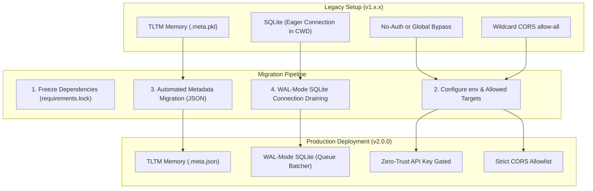

# PromptEvo v1.x.x to v2.0.0 — Migration & Upgrade Guide

This guide details the procedure for migrating a PromptEvo deployment from the legacy prototype (v1.x.x) to the enterprise-hardened production version (v2.0.0). 

It covers environment configuration changes, step-by-step upgrade instructions, database migrations, operational risks, and rollback procedures.

---

## 📋 Architectural Overview of the Upgrade



---

## ⚙️ Environment Variables Updates

Version 2.0.0 introduces several new environment variables and deprecates insecure legacy flags. Update your `.env` configuration file according to the following matrix:

| Variable Name | Type | Legacy Default (v1.x.x) | New Requirement (v2.0.0) | Description |
|---|---|---|---|---|
| `ENVIRONMENT` | `string` | *Absent* | `production` / `development` | Gates developer debug tools and auth bypasses. |
| `PROMPTEVO_API_KEYS` | `string` | *Absent* | *Required in Prod* (Comma-separated keys) | Authorised client API keys. |
| `PROMPTEVO_ALLOWED_TARGETS` | `string` | *Absent* | *Required in Prod* (Comma-separated models) | Allowlist of target model IDs. |
| `PROMPTEVO_DEV_DISABLE_AUTH` | `boolean` | `true` | `false` (Bypassed ONLY in dev) | Development auth bypass gate. |
| `PROMPTEVO_CORS_ORIGINS` | `string` | `*` | Comma-separated domains | Allowed frontend origins. Wildcards blocked. |
| `PROMPTEVO_DATA_DIR` | `string` | *Absent* | `/app/data` (or local absolute path) | Overrides root path for data and reports. |
| `SQLITE_CHECKPOINT_PATH` | `string` | `checkpoints.db` | Central absolute path | Path to SQLite checkpointer database. |
| `SQLITE_WRITE_INTERVAL_MS` | `integer` | *Absent* | `500` | SQLite batcher write queue drain interval (ms). |
| `REDIS_URL` | `string` | `redis://localhost:6379/0`| *Optional / Recommended* | Shared Redis persistence layer connection string. |

---

## 🛠️ Step-by-Step Upgrade Steps

### Step 1: Lock Dependencies and Rebuild Virtual Environment
First, purge any legacy un-versioned dependencies and leverage the locked requirements list for reproducible environments:
```bash
# Deactivate and delete your old virtual environment
deactivate
rm -rf .venv

# Rebuild the environment using the uv package manager
pip install uv
uv venv .venv
source .venv/bin/activate

# Install the locked, secure dependencies
uv pip install -r requirements.lock
```

### Step 2: Set Up Directory Structures and Absolute Paths
PromptEvo v2.0.0 resolves paths absolutely via `core/paths.py`. If deploying locally, ensure directories are mapped correctly:
```bash
# Create absolute directory paths
mkdir -p data/memory/tltm_vectors
mkdir -p reports
```
If deploying in containerized environments, these directories should be mapped via Docker Volumes as defined in `docker-compose.yml`.

### Step 3: TLTM Metadata Migration (Pickle to JSON)
PromptEvo v2.0.0 completely purges insecure `.pkl` deserialization.
* **Automated Migration (Recommended)**: The system implements an automated migration shim. The first time a session accesses a legacy `.meta.pkl` record in `data/memory/tltm_vectors/`, the framework loads it *once*, instantly writes it out as `.meta.json`, and deletes the legacy `.pkl` file, printing a deprecation trace.
* **Bulk Migration Script**: If you have thousands of records on disk and wish to perform a bulk migration prior to startup to minimize first-access latencies, execute this scratch script:
```python
# Save this in scratch/migrate_tltm.py and execute
import glob
import os
import pickle
import json
from core.paths import TLTM_VECTORS_DIR

def migrate_bulk():
    pkl_files = glob.glob(os.path.join(str(TLTM_VECTORS_DIR), "*.meta.pkl"))
    print(f"Found {len(pkl_files)} legacy pickle metadata files to migrate.")
    
    for pkl_path in pkl_files:
        try:
            with open(pkl_path, "rb") as f:
                record_data = pickle.load(f)
            
            # Formulate output json path
            json_path = pkl_path.replace(".meta.pkl", ".meta.json")
            
            # ExperienceRecord has __dict__ or is a dict
            data_to_save = record_data.__dict__ if hasattr(record_data, "__dict__") else record_data
            
            with open(json_path, "w", encoding="utf-8") as f:
                json.dump(data_to_save, f, default=str)
                
            os.remove(pkl_path)
            print(f"Migrated: {os.path.basename(pkl_path)}")
        except Exception as e:
            print(f"Failed migrating {os.path.basename(pkl_path)}: {e}")

if __name__ == "__main__":
    migrate_bulk()
```

### Step 4: Run the Regression Test Suite
Verify that all core routing, security boundaries, persistence checkpoints, and concurrency batchers are fully operational:
```bash
pytest tests/
```
Ensure all 34 suites return a `PASSED` status before proceeding to launch the API.

---

## 🔄 Rollback Procedures

If critical regressions are detected post-upgrade and a rollback to v1.x.x is required, follow this recovery plan:

### Step 1: Revert Git Workspace
Revert codebase files to your legacy commit or tag (e.g., `v1.2.0`):
```bash
git checkout v1.2.0
```

### Step 2: Roll Back Metadata Serialization (JSON to Pickle)
Legacy v1.x.x *cannot* parse `.meta.json` files and expects binary `.meta.pkl` format. Run the following rollback script *before* starting the legacy application:
```python
# Save this in scratch/rollback_tltm.py and execute
import glob
import os
import json
import pickle
from core.paths import TLTM_VECTORS_DIR

def rollback_bulk():
    json_files = glob.glob(os.path.join(str(TLTM_VECTORS_DIR), "*.meta.json"))
    print(f"Found {len(json_files)} json metadata files to roll back.")
    
    for json_path in json_files:
        try:
            with open(json_path, "r", encoding="utf-8") as f:
                record_data = json.load(f)
                
            pkl_path = json_path.replace(".meta.json", ".meta.pkl")
            
            with open(pkl_path, "wb") as f:
                pickle.dump(record_data, f)
                
            os.remove(json_path)
            print(f"Rolled back: {os.path.basename(json_path)}")
        except Exception as e:
            print(f"Failed rolling back {os.path.basename(json_path)}: {e}")

if __name__ == "__main__":
    rollback_bulk()
```

### Step 3: Rebuild Old Dependencies
Legacy v1.x.x did not compile dependencies via locked requirement schemas:
```bash
pip install -r legacy_requirements.txt
```

---

## ⚡ Upgrade Risks & Mitigations

### 1. API Gating Locking Out Active Integrations
* **Risk**: Authenticating by default via `X-PromptEvo-Key` will immediately cause active tools, external pipelines, or legacy frontends (e.g., un-migrated Streamlit dashboards) to fail with `HTTP 401 Unauthorized` or `HTTP 403 Forbidden`.
* **Mitigation**: Update all clients to inject the `X-PromptEvo-Key` header. If deploying in a staging/development sandbox, you may set `ENVIRONMENT=development` and `PROMPTEVO_DEV_DISABLE_AUTH=true` *temporarily* to allow integrations to migrate in phases.

### 2. Client Parsing Failures on Structured Errors
* **Risk**: The API now returns standard structured errors matching the `ErrorResponse` schema (JSON objects containing `detail` and `error_code` keys) instead of returning legacy raw error strings. Clients checking strictly for substring patterns may fail.
* **Mitigation**: Review [docs/api_errors.md](file:///c:/Users/Mahmoud%20Salman/Downloads/prompt_evo%20-%20Claude/docs/api_errors.md). Update client gateways to parse the JSON `detail` key instead of scanning raw responses.

### 3. Redis Connectivity Fallbacks
* **Risk**: In a multi-worker environment, if Redis fails, the system falls back to in-process dicts + WAL-mode SQLite batching. While this keeps single nodes running, concurrent requests dispatched to other worker nodes will lose session sync (since states are isolated in memory per process).
* **Mitigation**: Multi-worker setups must monitor Redis connectivity closely. The `/api/v1/health` endpoint exposes real-time database liveness; set up automated monitoring to alert if `health` indicates degraded fallbacks.

### 4. Format Failures on Client-Supplied Session IDs
* **Risk**: Legacy clients that generate session identifiers using custom sequential keys (e.g., `session_1`, `session_2`) will trigger validation rejections.
* **Mitigation**: Update clients to generate standard UUID4 strings (e.g., using Python's `uuid.uuid4()` or JS `crypto.randomUUID()`) when triggering `POST /api/v1/audit`.

---

## ⚠️ Known Limitations & Remaining Technical Debt

* **Synchronous Thread-pool Execution**: The LangGraph execution model remains synchronous. Scaled environments must allocate appropriate FastAPI thread pools (`workers = 1` as forks are disabled due to memory/graph persistence boundaries).
* **Monolithic Obfuscation Files**: `agents/hive_mind.py` remains a very large module (103 KB). Changes to obfuscation tiers or PAP techniques must be tested aggressively using the provided test suites to prevent regressions.
